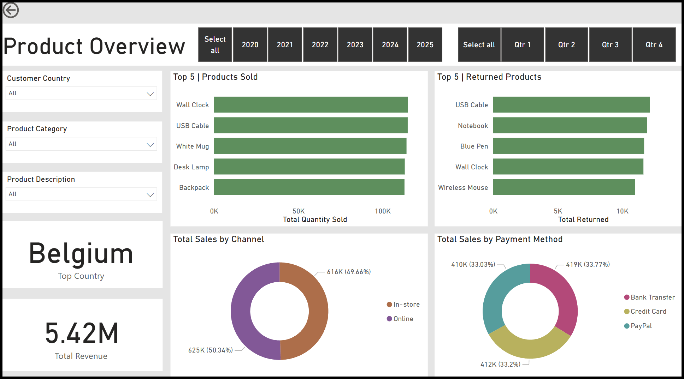

# Online Sales Dataset Analysis

This project analyzes a dataset containing online sales data to identify trends and patterns in consumer behavior. The analysis focuses on understanding factors like sales performance, customer segmentation, and product trends.

## 📊 Dataset

The dataset used for this analysis is from Kaggle, specifically the [Online Sales Dataset](https://www.kaggle.com/datasets/yusufdelikkaya/online-sales-dataset). It contains transactional data for an online retail store, which is used to analyze sales performance, customer behavior, and product trends.

## 💻 Technologies Used
- **Python**: For data cleaning, analysis, and visualization.
- **Pandas**: For data manipulation and analysis.
- **SQL**: For querying and processing data.
- **PowerBI**: For building interactive dashboards and visualizing results.

## 🚀 Project Overview
The goal of this project is to analyze the online sales dataset and uncover actionable insights that can help businesses improve their sales strategy. The analysis includes:
- **Sales Trend Analysis**: Understanding the sales performance over time.
- **Customer Segmentation**: Segmenting customers based on their purchasing behavior.
- **Product Performance**: Identifying which products are performing the best.
- **Sales Forecasting**: Using historical data to predict future sales (in progress).

## 🛠️ Project Structure

├── Data/ │ └── Online_Sales_Final.csv # Final dataset used for analysis and dashboard │ ├── Images/ │ ├── Product_overview.png # Screenshot of product performance dashboard │ └── Sales_overview.png # Screenshot of sales performance dashboard │ ├── src/ │ ├── EDA.ipynb # Notebook for data exploration and cleaning │ ├── Migration_SQL.ipynb # SQL migration examples / transformation logic │ └── functions.py # Helper functions (if any used in notebooks) │ ├── Online_Sales.pbix # Power BI dashboard file ├── SQL_queries.sql # SQL scripts used in data preparation ├── README.md # Project documentation

## 📊 Dashboard Analysis Overview

This analysis includes various interactive visualizations that provide key business insights:

### Sales Overview
- **Total Revenue**: Displayed as a headline figure and broken down by product category (Furniture, Accessories, Electronics, Apparel, Stationery), customer country, and year/quarter.
- **Geographical Insights**: A map shows total revenue distribution across different countries.
- **Trend Over Time**: A line chart tracks revenue progression from 2020 to 2025.

### Product Overview
- **Top Products Sold and Returned**: Bar charts highlight the most sold and most returned items (e.g., USB Cable, Wall Clock).
- **Top Country**: Displays the top-performing country according to selected filters (e.g., Belgium in this case).
- **Sales by Channel**: Donut chart comparing in-store vs. online sales.
- **Sales by Payment Method**: Breakdown of sales via Bank Transfer, Credit Card, and PayPal.

These dashboards provide a comprehensive view of sales performance, product trends, customer behavior, and revenue distribution. All visuals are dynamic and update based on filter selections for deeper analysis.

### Example Power BI Dashboard:

Here is an example of the dashboards created using Power BI:

